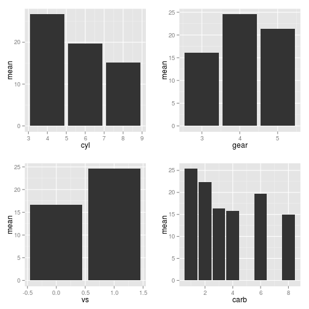

## Introduction and view of shiny application

This shiny application enables user to explore the different factors influencing mpg. Those factors include number of forward gear, number of cylinder and number of carburetors. Besides the visual interaction of factors influencing the mpg, the user can estimate the mpg by themselves. They can enter the weight of carn displacement and type of transmission, the algorithm will feedback the estimated mpg. It is very useful for both customers and car sellers.


--- .class #id 

#### View of shiny application
image: 

---
#### Upper side of shiny application
The upper side enables the user to explore the relation between mpg and forward gear/ cylinder etc. The relation are shown as following. x axis is the levels of those factors, y axis is the mean of mpg.

 

---
#### Down side of shiny application
The down side of shiny application is the estimation of mpg by specifying the parameter by user. To estimate the mpg, the linear regression is a good method.

For example, given parameters

```r
para <- data.frame(disp=c(200), hp=c(100), wt=c(3), cyl=c(4),am=c(1),vs=c(1))
para
```

```
##   disp  hp wt cyl am vs
## 1  200 100  3   4  1  1
```
We can fit the linear model

```r
modFit <- train(mpg ~ disp + hp + wt + cyl + am + vs, method="glm", data=mtcars)
prediction <- predict(modFit, para)
```

The estimated mpg is 25.4042738
